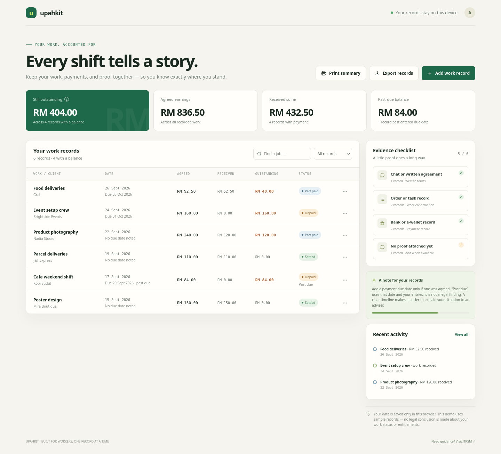
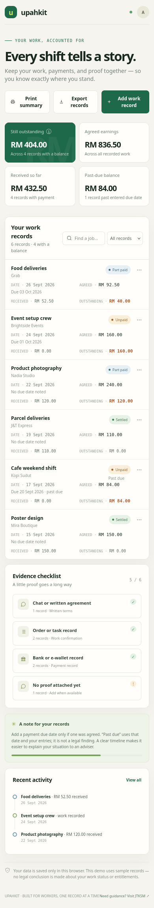

# UpahKit

**Keep your work, payments, and proof together.** UpahKit is a small, browser-based record organizer for Malaysian gig workers and freelancers who need a clearer picture of agreed income and outstanding payments.





**Try the live demo:** https://upahkit-lexhack-2026.onrender.com

## Run it

No build step, account, API key, or paid service is required. Open `index.html` in a modern browser, or serve this folder locally:

```sh
python3 -m http.server 4173
```

Then visit `http://localhost:4173`.

## Run the Firefox end-to-end check

```sh
npm install
npx playwright install firefox
npm run test:e2e
```

The browser automation is a development-only dependency. It exercises adding, editing, filtering, exporting, printing, and deleting records, and refreshes the screenshots in `screenshots/`.

## Demo flow

1. Review the fictional sample work and payment records.
2. Add a job with its date, agreed pay, payment received, notes, and the type of proof you have.
3. Optionally enter the agreed payment due date. UpahKit marks a balance past due only when that user-entered date has passed.
4. Search or filter records, update them when a payment arrives, and review total and past-due balances.
5. Export a CSV or print a summary to discuss with a qualified adviser.

The sample dashboard totals RM836.50 agreed, RM432.50 received, and RM404.00 outstanding. Each record’s outstanding amount is calculated as `max(agreed pay − received, 0)`.

## Competitive context

Gridwise emphasizes syncing earnings across gig platforms, comparing market pay, and tracking mileage and expenses. Everlance focuses on mileage and expense records for self-employed and gig workers. UpahKit stays narrower: a worker-entered ledger for each job, partial payment, due date, and evidence note, ending in an adviser-ready summary. It does not ask users to connect accounts or upload sensitive records. See [Gridwise](https://gridwise.io/) and [Everlance](https://www.everlance.com/).

## Data and limits

- Records are stored in this browser’s `localStorage`. There is no account, backend, analytics, AI model, or network submission of record data.
- Evidence is a note about what the worker has (for example, a chat, order record, or bank record). The prototype does not upload or store evidence files.
- Demo records are fictional. Do not use sensitive identity details in this prototype.
- Amounts are based only on user-entered data. UpahKit does not determine employment status, legal entitlement, or whether a payment is recoverable, and is not legal advice.
- The JTKSM link is a general pointer to an official department site. Users should check current guidance and speak with a qualified adviser about their specific situation.

## Stack

Vanilla HTML, CSS, and JavaScript. Browser `localStorage`, CSV download, and the native print dialog provide the prototype’s persistence and exports. No third-party runtime dependencies are used.

## Project files

- `index.html` — interactive prototype
- `SUBMISSION.md` — editable Devpost submission copy and demo-video outline
- `AGENTS.md` — product goals, safety boundaries, and engineering conventions
